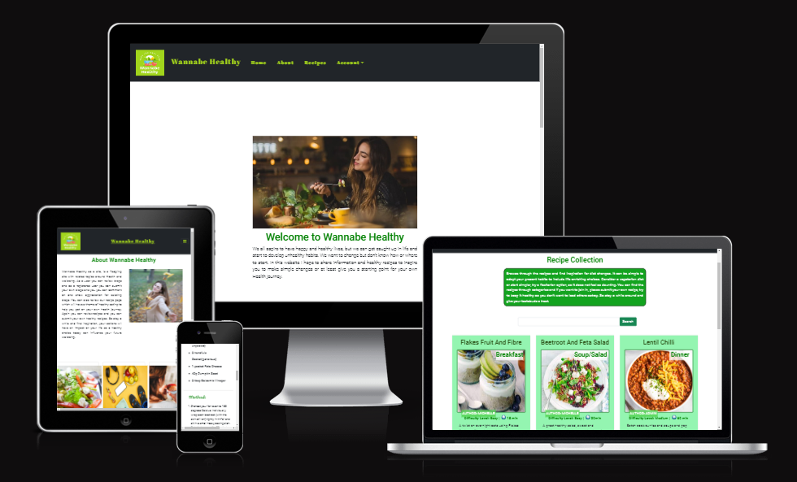

# Wannabe Healthy: Milestone 4 Project

      
          

   

 
## Introduction   

Wannabe Healthy is the 4th Project for the Code Institute and the Project is a Full Stack website using the Django Framework. The website's content deals with health related topics. It encompasses a Blog with various health categories and a Recipe section which concentrates on health enhancing recipes.  When logged in a User can add, edit or delete their own submitted Blog/Recipe. A logged in User can like/unlike a post or recipe or add comments for either. A logged in User can also view and Update their own Profile with an uploaded image and a Bio. 

 

[Visit the WannabeHealthy Site](https://.herokuapp.com/)  

[Visit the WannabeHealthy Repository](https://github.com/MHickey2/)

   

- [Wannabe Healthy: Milestone 4 Project](#wannabe-healthy-milestone-4-project)
  - [Introduction ](#introduction-)
  - [1. UX Strategy ](#1-ux-strategy-)
    - [1. The Business Goals of the Website: ](#1-the-business-goals-of-the-website-)
    - [2. The Target Customer: ](#2-the-target-customer-)
      - [Return to Table of Contents](#return-to-table-of-contents)
  - [2. User Stories  ](#2-user-stories--)
    - [1. As a website User I can...](#1-as-a-website-user-i-can)
    - [2. As a logged in User I can... ](#2-as-a-logged-in-user-i-can-)
    - [3. As a website superuser, I can …..    ](#3-as-a-website-superuser-i-can-----)
      - [Return to Table of Contents](#return-to-table-of-contents-1)
  - [3. Design  ](#3-design--)
    - [1. Colour  Scheme  ](#1-colour--scheme--)
    - [2. Typography    ](#2-typography----)
    - [3. Imagery    ](#3-imagery----)
    - [4. Wireframes    ](#4-wireframes----)
      - [Return to Table of Contents](#return-to-table-of-contents-2)
  - [4. Database Diagram](#4-database-diagram)
      - [Return to Table of Contents](#return-to-table-of-contents-3)
  - [5. Features  ](#5-features--)
    - [1. Home Page   ](#1-home-page---)
    - [2. Blog Section      ](#2-blog-section------)
    - [3. Blog Search   ](#3-blog-search---)
    - [4. Add Blog     ](#4-add-blog-----)
    - [5. Edit Blog     ](#5-edit-blog-----)
    - [6. Delete Blog     ](#6-delete-blog-----)
    - [7. Blog Detail Page      ](#7-blog-detail-page------)
    - [8. About Page    ](#8-about-page----)
    - [9. Recipes Page   ](#9-recipes-page---)
    - [10. Recipes Search   ](#10-recipes-search---)
    - [11. Add Recipe   ](#11-add-recipe---)
    - [12. Edit Recipe   ](#12-edit-recipe---)
    - [13. Delete Recipe   ](#13-delete-recipe---)
    - [14. Recipe Detail Page   ](#14-recipe-detail-page---)
    - [15. Profile Page   ](#15-profile-page---)
    - [16. Edit Profile  Page   ](#16-edit-profile--page---)
    - [17. Signup Page   ](#17-signup-page---)
    - [18. Login Page   ](#18-login-page---)
    - [19. Logout Page   ](#19-logout-page---)
      - [Return to Table of Contents](#return-to-table-of-contents-4)
  - [6. Future Implementation  ](#6-future-implementation--)
      - [Return to Table of Contents](#return-to-table-of-contents-5)
  - [7. Tools and Technology  ](#7-tools-and-technology--)
    - [Language Used:](#language-used)
    - [Technology Used:](#technology-used)
      - [Django Packages](#django-packages)
      - [Return to Table of Contents](#return-to-table-of-contents-6)
  - [8. Testing  ](#8-testing--)
    - [1. Manual Testing   ](#1-manual-testing---)
      - [Feature being tested and Result](#feature-being-tested-and-result)
    - [2. User Story Testing](#2-user-story-testing)
      - [As a Website User I want to .....](#as-a-website-user-i-want-to-)
      - [As a logged in User I want to …...](#as-a-logged-in-user-i-want-to-)
      - [As a Superuser/Admin I want to …..](#as-a-superuseradmin-i-want-to-)
    - [3. General Testing   ](#3-general-testing---)
      - [Browser Testing](#browser-testing)
      - [Responsive Testing](#responsive-testing)
    - [Validation      ](#validation------)
      - [HTML Checker](#html-checker)
      - [Lighthouse Testing](#lighthouse-testing)
      - [Return to Table of Contents](#return-to-table-of-contents-7)
  - [9. Bugs and Issues  ](#9-bugs-and-issues--)
    - [Resolved ](#resolved-)
    - [Unresolved ](#unresolved-)
      - [Return to Table of Contents](#return-to-table-of-contents-8)
  - [10. Deployment ](#10-deployment-)
      - [Creating the Django app  ](#creating-the-django-app--)
    - [How to make a local Clone ](#how-to-make-a-local-clone-)
    - [How to fork a GitHub Repository ](#how-to-fork-a-github-repository-)
    - [Student Template ](#student-template-)
    - [Deploying to Heroku ](#deploying-to-heroku-)
      - [Return to Table of Contents](#return-to-table-of-contents-9)
- [Credits ](#credits-)
      - [Return to Table of Contents](#return-to-table-of-contents-10)
  - [Acknowledgements ](#acknowledgements-)
      - [Return to Table of Contents](#return-to-table-of-contents-11)

----

## 1. UX Strategy 
----

  

### 1. The Business Goals of the Website: 
- No commercial goals, but the site's goal is to to provide a resource for those seeking to improve their health and learn about health topics.
  
    

### 2. The Target Customer: 

Anyone with the desire to improve their health.
Anyone who wants to improve their Diet with healthy Recipes.

    

 #### [Return to Table of Contents](#toc)

----

Site User

The user is really anyone who wants to gain a healthier lifestyle. They can not only view present blogs and recipes but can play more of an interactive role and contribute their own blogs and recipes.  In this way the stite will grow organically and will be open to evolving dependg on the latest health trends. 

Site Goals
The site allows the user to know the content of the site easily and can navigate through it easily.
The user will be able to use the search facility to find specific blogs by category and title.
The user when logged in will be able to contribute to the site in regards to blogs and recipes, they will also be able to like and comment on individual blogs and recipes.
The user will be able to maintain a profile on the site and they can update their Profile details and Users can learn more about them.

 

## 2. User Stories  

 

### 1. As a website User I can...
1. Navigate around the site and easily view the type of content available.
2. View a collection of Blogs in the blog Section.
3. Search the blog section for particular categories or by title content.
4. Click on a blog item and view more indepth content of the selected blog.
5. Register for an account to avail of full features of the site.
6. View the number of likes on a blog.
7. View comments left for different blogs in the collection.
8. View a collection of Recipes in the Recipe Page.
9. Search through recipes for particular categories or by name in title.
10. Click on a Recipe to see full details of that recipe.
11. View the number of likes on a Recipe.
12. View any comments left on a Recipe. 

  

   

### 2. As a logged in User I can...  

1. I can add a new post or a recipe.
2. I can like/unlike a blog or recipe on the site.
3. I can leave comments on particular blogs and recipes.
4. Update my Profile for the site by adding a Bio and Image.
5. I can edit a Blog or Recipe that I have submitted to the site.
6. I can delete a Recipe or Blog that I have submitted to the site.

 
  

### 3. As a website superuser, I can …..    

1. Create and publish a new blog or recipe.
2. Create draft recipes and blog posts that can be finalised later.
3. Create a new user, recipes, blogs and categories.
4. Delete user, blogs, recipes, categories and comments.
5. Can approve user's comments.

     

#### [Return to Table of Contents](#toc)  
----
## 3. Design   

 

### 1. Colour  Scheme  

### 2. Typography    

The 'Roboto' font is the main font used for the whole project  

 

### 3. Imagery    

 

 
### 4. Wireframes    

 

 

 #### [Return to Table of Contents](#toc)
----

## 4. Database Diagram
 

      
         

  

 #### [Return to Table of Contents](#toc)
----

 

## 5. Features  

 

### 1. Home Page   

The home page has an intro image and a short paragraph of text explaining the purpose of
the site.  
  

 

      
         

  

### 2. Blog Section      

On the home page there is a blog section which holds a collection of blogs ordered with the most recent blog at the top. The pagination allows for the blogs to be distributed according to the number of blogs it contains.

 

      
         

  

### 3. Blog Search   

The website user can use the search facility to find specific categories, that are presented to the user and they can also search by a name in the title.

      
         

  

###  4. Add Blog     

As a logged in User you can add a blog to the site, when you press on the add blog link it will take you to the add blog page, when this form is completed you will be redirected to the home page, where your new blog will be displayed.

 

      
         

  

### 5. Edit Blog     

As a logged in User you will be able to see the edit button below your submitted blogs, when you use the edit button you will be redirected to the edit blog page, where you can update your blog, when the form is completed you will be redirected to the home page.

 

      
         

  

###  6. Delete Blog     

As a logged in User you will be able to see the delete button below your submitted blogs, when you use the delete button you will be redirected to the delete blog page, where you can delete your blog, when the form is completed you will be redirected to the home page.

 

      
         

 

### 7. Blog Detail Page      

When you select a blog, you will be redirected to the blog detail page, this page will show the full content for that specific blog. If you are a logged in user you can add a comment. This comment will have to be approved by the admin before it will be displayed on the site.

 

      
         

  

###  8. About Page    

The About Page again contains a brief synopsis of the site and contain information panels that display the main elements of the site. The accompanying links will take you to either the blog section or the recipe section of the site.
 

      
         

  

###  9. Recipes Page   

On the Recipes page there is a collection of Recipes ordered with the most recent Recipe at the top. The pagination allows for the Recipes to be distributed according to the number of recipes in the collection.

 

      
         

  

###  10. Recipes Search   

The website user can use the search facility to find specific categories ie Breakfast, Lunch, Dinner, Dessert and Soup/Salad. You can also search according to a specific word in the title.

 

      
         

  

###  11. Add Recipe   

As a logged in User you can add a Recipe to the site, when you press on the add a Recipe  link it will take you to the 'add Recipe page', when this form is completed you will be redirected to the Recipes page, where your new Recipe will be displayed.

 

      
         

  

###  12. Edit Recipe   

As a logged in User you will be able to see the edit button below your submitted Recipe, when you use the edit button you will be redirected to the 'edit your Recipe page', where you can update your Recipe, when the form is completed you will be redirected to the Recipes page.

 

      
         

  

###  13. Delete Recipe   

As a logged in User you will be able to see the delete button below your submitted Recipe, when you use the delete button you will be redirected to the delete Recipe page, where you can delete your Recipe, when the form is completed you will be redirected to the Recipes page.

 

      
         

  

###  14. Recipe Detail Page   

When you select a Recipe, you will be redirected to the Recipe detail page, this page will show the full content for that specific Recipe. If you are a logged in user you can add a comment. This comment will have to be approved by the admin before it will be displayed on the site.

 

      
         

  

###  15. Profile Page   

On the Profile Page, the User can have access to their own profile information. The profile will be automatically created when they register for the site.

 

      
         

###  16. Edit Profile  Page   

The logged in user can access the Edit Profile Page and can upload an image and add a Bio to their Profile. 
 

      
         

###  17. Signup Page   

On the Signup Page, a new user can sign up for the Wannabe Healthy website by filling out and submitting the form.

 

      
         

 

###  18. Login Page   

A registered User can log in to the website by inputting the username and password and they will have full access to all the features of the site.
 

      
         

  

###  19. Logout Page   

In the Logout Page, the User can confirm that they want to exit the website.

 

      
         

   

 #### [Return to Table of Contents](#toc)
----
 ## 6. Future Implementation  

  

 

 

 #### [Return to Table of Contents](#toc)
----
 ## 7. Tools and Technology  

### Language Used:

-   [Python 3.8.10](https://www.python.org/)
-   [HTML5](https://en.wikipedia.org/wiki/HTML5)        &nbsp; [CSS3](https://en.wikipedia.org/wiki/CSS)
-   [JavaScript](https://www.javascript.com/)
-   [Django](https://www.python.org/)

### Technology Used:

-   [Git:](https://git-scm.com/) used for version control, updated changes and commited changes and this in turn updated in Heroku 
-   [GitHub:](https://github.com/) is the respository for all the git pushes.
-   [Gitpod](https://gitpod.io/) was the IDE Editor
-   [Heroku:](https://heroku.com) used to deploy the application.
-   [Google Chrome Dev Tools](https://developer.chrome.com/docs/devtools/)
-   [Markdown](https://markdown-guide.readthedocs.io/en/latest/)
-   [Cloudinary](https://cloudinary.com/)
-   [PostgreSQL](https://www.postgresql.org/)
-   [Bootstrap](https://getbootstrap.com/)
-   [Draw.io](https://drawio-app.com/)
 
#### Django Packages

* [Gunicorn](https://gunicorn.org/) 
   As the server for Heroku
* [Cloudinary](https://cloudinary.com/) 
   Was used to host the static files and media
* [Dj_database_url](https://pypi.org/project/dj-database-url/) 
   To parse the database URL from the environment variables in Heroku
* [Psycopg2](https://pypi.org/project/psycopg2/) 
   As an adaptor for Python and PostgreSQL databases
* [Summernote](https://summernote.org/) 
   As a text editor
* [Allauth](https://django-allauth.readthedocs.io/en/latest/installation.html) 
   For authentication, registration, account
   management
* [Crispy Forms](https://django-crispy-forms.readthedocs.io/en/latest/) 
   To style the forms
 

 #### [Return to Table of Contents](#toc)
----
## 8. Testing  
 

### 1. Manual Testing   

 

#### Feature being tested and Result                                                    

- Start Screen displays when Heroku link is used.   :heavy_check_mark:

 

 

### 2. User Story Testing

  

#### As a Website User I want to .....

- 
- 
- 

 

#### As a logged in User I want to …...  

-    
-         
- 

 

#### As a Superuser/Admin I want to …..    
- 
- 
- 
- 
 
- 

 

### 3. General Testing   

 

#### Browser Testing

The site was tested on Google Chrome, Firefox and Microsoft edge, and there seemed to be no issues on any of the browsers.

 

#### Responsive Testing

In regards to responsive testing

 

      
         

  

 

### Validation      

 

I used pep8 validation 

  
    
         

  

      
         

  

 

#### HTML Checker     

      
         

 

#### Lighthouse Testing

      
         

  

 #### [Return to Table of Contents](#toc)
----

 ## 9. Bugs and Issues  

 

 ### Resolved 

 
  

 ### Unresolved 

 

 

 #### [Return to Table of Contents](#toc)
----

 ## 10. Deployment 

  

#### Creating the Django app  

 ### How to make a local Clone 
1. Navigate to the main page of the repository.
2. Click the green Code Button at top right of the repository.
3. Copy the url for the repository.
4. Open Git Bash and Change the current working directory to where you want the cloned directory.
5. Type git clone, and then paste the URL you previously copied using $ git clone. 
6. Pressing enter will then create your clone.  

   

### How to fork a GitHub Repository 
1. Log into GitHub and go to the required Repository.
2. The Fork button is found at the top right corner of the page.
3. When you click this button you will have a copy of the repository in your own GitHub account.  

   

 ### Student Template 
 This Template has been provided by the Code Institute and includes a number of tools to make life easier and has been used within this present site.    

 

### Deploying to Heroku 
- After registering on the Heroku site, you can see the dashboard. You can select 'New' and then click 'Create new app'. You need to pick a unique name for your app, it will let you know if it is  to available to use.
- Select your region and create your app.
- Go to the settings tab and scroll until you find the config vars section and pick 'Reveal config vars',
in this case I added 'PORT' into the key field and added '8000' into the value field and click 'add'.
- If you have credentials, for your project, you must create another config vars called 'CREDS' and 
you would paste the JSON into the value field.
- You have to to the builldpacks section and click 'add buildpack'.
- In this case I added 'Python' and 'saved changes, and did the same with 'Node'.
- Next you go to the Deploy tab and you select 'github' and confirm connection to your GitHub Account.
- You search for your project repository and click to 'connect'.
- Under the deploy options, you can chose automatic deploys, this allow you to automatically deploy each
time you push to your Repository.
- To deploy, you would choose what branch you want to deploy and click on 'Deploy Branch'.
- It takes a little time to build your app but when it is ready you can open your app by using the link provided
  
  

More information is available at [https://docs.github.com/en](https://docs.github.com/en), in regards to GitHub and is a great reference point for all GitHub queries.

 
#### [Return to Table of Contents](#toc)
----
 # Credits 
     

 I also used the following online resources:

- [Code Institute](https://codeinstitute.net/ie/)
- [Slack](https://slack.com/intl/en-ie/) 
- [Stack OverFlow](https://stackoverflow.com)
- [YouTube](https://www.youtube.com/)
- [W3Schools.com](https://www.w3schools.com/)

 

#### [Return to Table of Contents](#toc)
----
 ## Acknowledgements 

 

 

 #### [Return to Table of Contents](#toc) 
----

 
