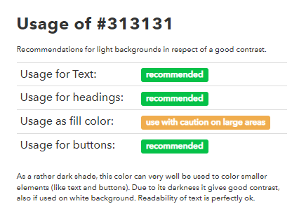
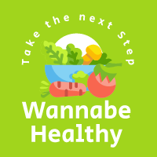
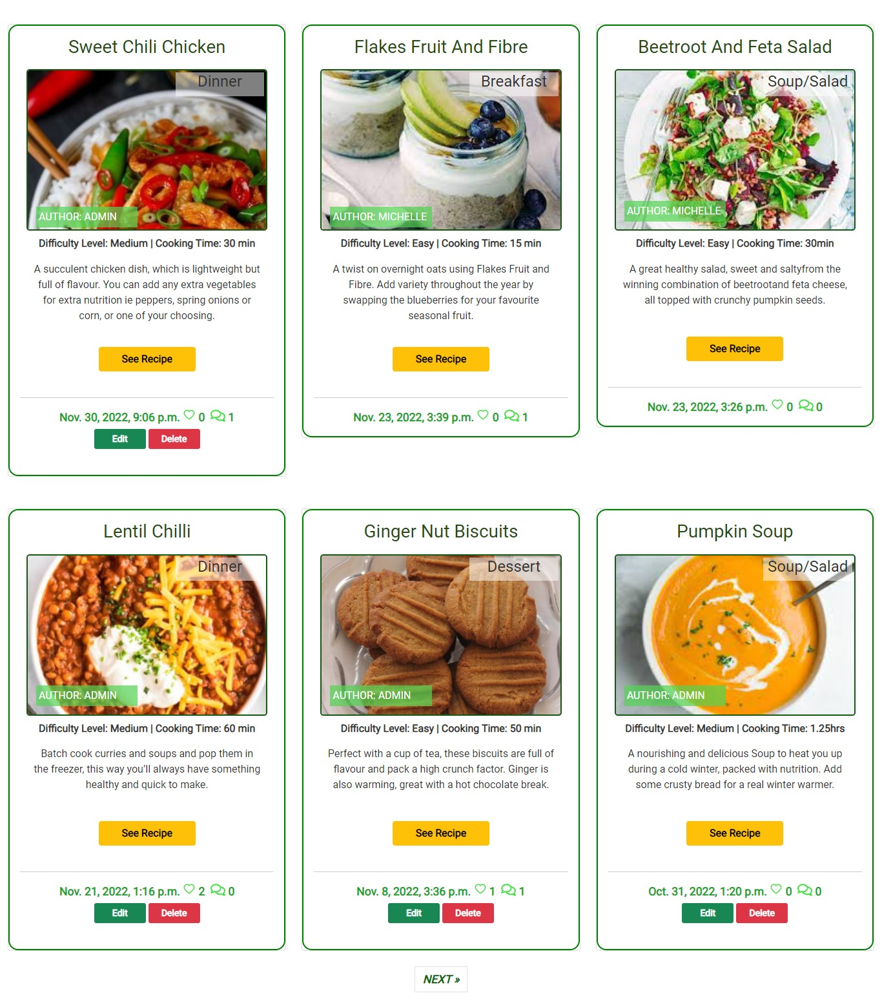
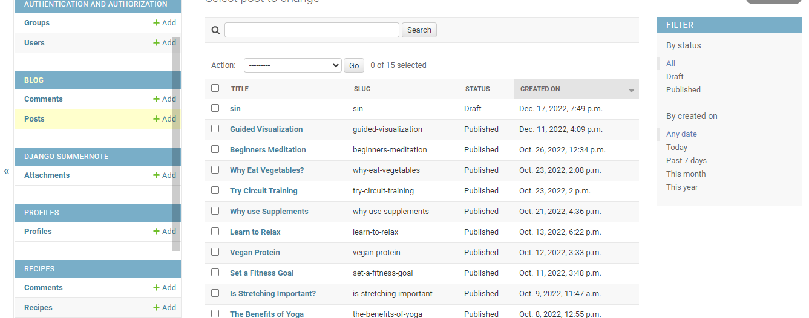

# Wannabe Healthy: Milestone 4 Project

      
          

   

 
# Introduction 

Wannabe Healthy is the 4th Project for the Code Institute and it is a Full Stack Website using the Django Framework. The website's content deals with health related topics. It encompasses a Blog with various categories and a Recipe section which concentrates on health enhancing recipes.  When logged in a User can add, edit or delete their own Blogs/Recipes. A logged in User can like/unlike a post/recipe or add comments. A logged in User can also view and Update their own Profile with an uploaded image and Bio information. 

 

[Visit the Wannabe Healthy Site](https://wannabe2022.herokuapp.com/) 

[Visit the Wannabe Healthy Repository](https://github.com/MHickey2/)

   

# Table of Contents 

- [Wannabe Healthy: Milestone 4 Project](#wannabe-healthy-milestone-4-project)
- [Introduction ](#introduction-)
- [Table of Contents ](#table-of-contents-)
  - [1. UX Strategy ](#1-ux-strategy-)
    - [1. The Business Goals of the Website: ](#1-the-business-goals-of-the-website-)
    - [2. The Target Customer: ](#2-the-target-customer-)
      - [Return to Table of Contents](#return-to-table-of-contents)
    - [Site User Profile](#site-user-profile)
    - [Site Goals](#site-goals)
  - [2. User Stories  ](#2-user-stories--)
      - [As a website User I can...](#as-a-website-user-i-can)
      - [As a logged in User I can... ](#as-a-logged-in-user-i-can-)
      - [As a website superuser, I can …..    ](#as-a-website-superuser-i-can-----)
  - [3. Agile Methodology](#3-agile-methodology)
      - [Return to Table of Contents](#return-to-table-of-contents-1)
  - [4. Design  ](#4-design--)
    - [1. Colour  Scheme  ](#1-colour--scheme--)
    - [2. Typography    ](#2-typography----)
    - [3. Imagery    ](#3-imagery----)
    - [4. Website Structure    ](#4-website-structure----)
    - [5. Wireframes    ](#5-wireframes----)
      - [Return to Table of Contents](#return-to-table-of-contents-2)
  - [5. Database Diagram](#5-database-diagram)
      - [Return to Table of Contents](#return-to-table-of-contents-3)
  - [6. Features  ](#6-features--)
    - [1. Home Page   ](#1-home-page---)
    - [2. Blog Section      ](#2-blog-section------)
    - [3. Blog Search   ](#3-blog-search---)
    - [4. Add Blog     ](#4-add-blog-----)
    - [5. Edit Blog     ](#5-edit-blog-----)
    - [6. Delete Blog     ](#6-delete-blog-----)
    - [7. Blog Detail Page      ](#7-blog-detail-page------)
    - [8. About Page    ](#8-about-page----)
    - [9. Recipes Page   ](#9-recipes-page---)
    - [10. Recipes Search   ](#10-recipes-search---)
    - [11. Add Recipe   ](#11-add-recipe---)
    - [12. Edit Recipe   ](#12-edit-recipe---)
    - [13. Delete Recipe   ](#13-delete-recipe---)
    - [14. Recipe Detail Page   ](#14-recipe-detail-page---)
    - [15. Profile Page   ](#15-profile-page---)
    - [16. Edit Profile  Page   ](#16-edit-profile--page---)
    - [17. Signup Page   ](#17-signup-page---)
    - [18. Login Page   ](#18-login-page---)
    - [19. Logout Page   ](#19-logout-page---)
    - [20. Custom Error Pages  ](#20-custom-error-pages--)
    - [21. Admin Panel  ](#21-admin-panel--)
      - [Return to Table of Contents](#return-to-table-of-contents-4)
  - [7. Future Implementation  ](#7-future-implementation--)
      - [Return to Table of Contents](#return-to-table-of-contents-5)
  - [8. Tools and Technology  ](#8-tools-and-technology--)
    - [Language Used:](#language-used)
    - [Technology Used:](#technology-used)
    - [Django Packages](#django-packages)
      - [Return to Table of Contents](#return-to-table-of-contents-6)
  - [9. Testing  ](#9-testing--)
      - [Return to Table of Contents](#return-to-table-of-contents-7)
  - [10. Bugs and Issues  ](#10-bugs-and-issues--)
    - [Resolved ](#resolved-)
    - [Unresolved ](#unresolved-)
      - [Return to Table of Contents](#return-to-table-of-contents-8)
  - [11. Deployment ](#11-deployment-)
    - [How to make a local Clone ](#how-to-make-a-local-clone-)
    - [How to fork a GitHub Repository ](#how-to-fork-a-github-repository-)
    - [Student Template ](#student-template-)
    - [Django Framework    ](#django-framework----)
    - [Deploying to Heroku ](#deploying-to-heroku-)
    - [Changes in Heroku  ](#changes-in-heroku--)
      - [Return to Table of Contents](#return-to-table-of-contents-9)
  - [Credits ](#credits-)
      - [Return to Table of Contents](#return-to-table-of-contents-10)
  - [Acknowledgements ](#acknowledgements-)
      - [Return to Table of Contents](#return-to-table-of-contents-11)

----

## 1. UX Strategy 
----

  

### 1. The Business Goals of the Website: 
No commercial goals, but the site's goal is to to provide a resource for those seeking to improve their health and learn more about various health topics.
  
    

### 2. The Target Customer: 

- Anyone with the desire to improve their health.
- Anyone who wants to improve their Diet with healthy Recipes.
- Anyone who enjoys reading blogs and would like to contribute blogs to the site.

    

 #### [Return to Table of Contents](#toc)

----

### Site User Profile

The user is really anyone who wants to achieve a healthier lifestyle. They can not only view present blogs and recipes but can play more of an interactive role and contribute their own blogs and recipes.  In this way the site will grow organically, and will be open to evolving depending on siteuser's needs.

### Site Goals

- The site allows the user to understand the theme of the site easily and will be able to navigate through the content easily.
- The user will be able to use the search facility to find specific blogs by category and title.
- The user when logged in will be able to contribute to the site in regards to blogs and recipes, they will also be able to like and comment on individual blogs and recipes.
- The user will be able to maintain a profile on the site and they can update their Profile details and will be able to interact with other user's over time.

 

## 2. User Stories  

 

####  As a website User I can...
1. Navigate around the site and easily view the type of content available.
[User Story: Create a Home Page for site #1](https://github.com/MHickey2/Wannabe-Healthy/issues/1)

2. View a collection of Blogs in the blog Section.
[User Story: View existing Posts #2](https://github.com/MHickey2/Wannabe-Healthy/issues/2)

3. Search the blog section for particular categories or by title content.
[User Story: Sort through Blogs #5](https://github.com/MHickey2/Wannabe-Healthy/issues/5)

4. Click on a blog item and view more indepth content of the selected blog.
[User Story: User can read individual Posts when selected #3](https://github.com/MHickey2/Wannabe-Healthy/issues/3)

5. Register for an account to avail of full features of the site.
[User Story: The user should be able to register for the site #7](https://github.com/MHickey2/Wannabe-Healthy/issues/7)

6. View the number of likes on a blog.
[User Story: User will want the ability to like posts #6](https://github.com/MHickey2/Wannabe-Healthy/issues/6)

7.  View comments left for different blogs in the collection.
[User Story: User can leave comments on Blogs #10](https://github.com/MHickey2/Wannabe-Healthy/issues/10)

8. View a collection of Recipes in the Recipe Page.
[User Story: Users can see Recipes in the site #15](https://github.com/MHickey2/Wannabe-Healthy/issues/15)

9. Search through recipes for particular categories or by name in title.
[https://github.com/MHickey2/Wannabe-Healthy/issues/21](https://github.com/MHickey2/Wannabe-Healthy/issues/21)

10. Click on a Recipe to see full details of that recipe.
[User Story: Users can see full details of individual recipes #16](https://github.com/MHickey2/Wannabe-Healthy/issues/16)

11. View the number of likes on a Recipe.
[User Story: User can like individual recipes #17](https://github.com/MHickey2/Wannabe-Healthy/issues/17)

12. View any comments left on a Recipe. 
[User Story: User will want to leave comment for individual Recipes #19](https://github.com/MHickey2/Wannabe-Healthy/issues/19)
  
   

####  As a logged in User I can...  

1. I can add a new post or a recipe.
[User Story: The logged in User should be able to add a blog to the Site. #9](https://github.com/MHickey2/Wannabe-Healthy/issues/9)
[User Story: User will want to add their own Recipes to the site #18](https://github.com/MHickey2/Wannabe-Healthy/issues/18)

2. I can like/unlike a blog or recipe on the site.
[User Story: User will want the ability to like posts #6](https://github.com/MHickey2/Wannabe-Healthy/issues/6)

3. I can leave comments on particular blogs and recipes.
[User Story: User can leave comments on Blogs #10](https://github.com/MHickey2/Wannabe-Healthy/issues/10)

4. I can update my Profile for the site by adding a Bio and Image.
[User Story: The logged in User should be able to add a blog to the Site. #9](https://github.com/MHickey2/Wannabe-Healthy/issues/9)

5. I can edit a Blog or Recipe that I have submitted to the site.
[User Story: User can edit the posts they have submitted #11](https://github.com/MHickey2/Wannabe-Healthy/issues/11)
[User Story: User will want to edit/update their submitted recipes #20](https://github.com/MHickey2/Wannabe-Healthy/issues/20)

6. I can delete a Recipe or Blog that I have submitted to the site.
[User Story: User can delete a post that they have submitted #12](https://github.com/MHickey2/Wannabe-Healthy/issues/12)
[User Story: User can Delete their own Recipes #22](https://github.com/MHickey2/Wannabe-Healthy/issues/22)

7. I will have confirmation when I carry out actions in the site.
[User Story: User will be kept informed of their activity within the site #14](https://github.com/MHickey2/Wannabe-Healthy/issues/14)

 
  

#### As a website superuser, I can …..    

1. Create and publish a new blog or recipe.
2. Create draft recipes and blog posts that can be finalised later.
3. Create a new user, recipes, blogs and categories.
4. Delete user, blogs, recipes, categories and comments.
5. Can approve user's comments.

[User Story: Admin Access for Admin Features #4](https://github.com/MHickey2/Wannabe-Healthy/issues/4)

    

## 3. Agile Methodology

The project was developed using Agile Methodology and it was by use of the GitHub Projects functionality within the GitHub Repository. The issues can be found [Here](https://github.com/MHickey2/Wannabe-Healthy/issues) and this is the link for the [WannabeProject Board](https://github.com/users/MHickey2/projects/1)

  

#### [Return to Table of Contents](#toc)  
----

## 4. Design   

 

### 1. Colour  Scheme  

The colour scheme has primarily a green colour, research has shown that green has a strong link with health related topics and it also relates to nature and I felt it was a natural choice for the content of the site. I had used more colour earlier in the development, but I stripped it back in the end, as I thought simplicity was key in highlighting the content without too much distraction. The following image highlights the main colours in the site, and the colours are mostly variations within the green hues.

 

      
           

      
   #337920    #A3D31C    #274612    #7DD661    #47D31C    #0CAF46      

  

### 2. Typography    

Google Fonts were used within the website. The 'Roboto' font is the main font used for the whole project, both for regular text and headings. Sans serif is the fallback font in case the other font is not available. See below for example of font in use. The font color is #313131, which is a good font to help counter eye strain.

 

      
           

 

The main title for the site and the navbar links use the 'Abril Fatface' font, A font it displays both neutrality and a strong presence on the page which helps to attract reader attention with the measured tension of its curves, good color and high contrast.

 

      
           

 

      
           

 

Other Fonts were used within the Recipe Details Section and the main headings use the 'Marhey' Font, as it gives a certain quirky touch to the Recipes, that gives the recipes their own unique styles.

 

      
           

 

### 3. Imagery    

The Logo was created with [LogoMaker](https://www.logomaker.com/), as the theme was health related, I used predominantly green in the logo iteself and the logo had a strong influence on the overall website colour theme going forward.

The imagery of the site focuses on a healthy theme, the images were souced from the Pexels site and supplement either the blog or the recipe. The images are all self sourced, but the User can update images to supplement their own blogs/recipes for the site. The images for the site are hosted in [Cloudinary](https://cloudinary.com/).

There are also images sporadically throughout the site, The home page has an image of a healthy woman, conveying a person with a healthy lifestyle. The about page again, shows a healthy woman living her best life and the information panels show images focuses on the main themes within the site.

There are also various icons used within the site, the icons were sourced at [Iconify.Design](https://iconify.design/), and they were used as a graphical representation of pertinent information on the site, they were used in conjunction with Forms or headings and were a subtle way to incorporate imagery on a limited scale, examples can be found in the image below.

I also created the favicon for the site with [Favicon.io](https://favicon.io)

 

      
         

 
 

  

 

  

 

### 4. Website Structure    

The website follows the standard website structure. The Logo and the website name are on the left hand side, and the naigation to the right, on the top of all pages. Within the Account Nav Link the user can either register or login to the site. When the user logs in they can see the Profile link and the logout button. The logged in user's image will also be visible. When the website is on smaller screens, there is a hamburger meu, with dropdown navigation items. The footer element is also available on all pages, with site information, contact details and social media icons.
 
 The website consists of the following Pages:
 - The Home Page, with an introduction to the site and holds the blog section and the search bar.
 - The Post Detail Page, that shows the information for individual blogs.
 - The Add Post Page, which is a form that allows the logged in User to add a blog.
 - The Edit Post Page, which is a form that allows the user to edit their own post.
 - The Delete Post Page, which is a form that allows the user to delete their own post.
 - The About Page, which gives more information on the site and specific panels that shows information on main topics.
 - The Recipe Page, with an introduction to Recipes and holds the recipe section and the search bar.
 - The Recipe Detail Page, that shows the information for individual Recipes.
 - The Add Recipe Page, which is a form that allows the logged in User to add a Recipe.
 - The Edit Recipe Page, which is a form that allows the user to edit their own Recipe.
 - The Delete Recipe Page, which is a form that allows the user to delete their own Recipe.
 - The Profile Page, which contains profile information on the registered User.
 - The Edit Profile Page, which contains a form that allows the User to add/update their profile information.
 - The Sign Up Page, consists of a form where a new user can register for the site.
 - The Login Page, consists of a form where the user can login to the site.
 - The logout Page, consists of a form where the user can logout of the site.
 - There are also custom error pages for errors 403,404,405 and 500.

 

### 5. Wireframes    

The Wireframes for the site were created in Figma, I concentrated on the standard websize and the mobile size. The midlevel sizes were generally in keeping with the main websize but just on a smaller scale. The Wireframes can be found below:

Figma Wireframes

  
1. Home Page Wireframes

  

         

  
2. Add Post Page Wireframe

   

  

  
3. Edit Post Page Wireframe

   

  

  
4. Delete Page Wireframe

   

  

  
4. Post Detail Page

   

  

  
4. About Page

   

  

  
4. Recipes Page

   

  

  
4. Add Recipe Page

   

  

  
4. Edit Recipe Page

   

  

  
4. Delete Recipe Page

   

  

  
4. Recipe Detail Page

   

  

  
4. Profile Page

   

  

  
4. Edit Profile Page

   

  

  
4. Registration Page

   

  

  
4. Login Page

   

  

  
4. Logout Page

   

  

 

 #### [Return to Table of Contents](#toc)
----

## 5. Database Diagram
 

  
Database ER Diagram

      
         

  

 #### [Return to Table of Contents](#toc)
----

 

## 6. Features  

There are features common to all pages in the site and these are found in the base.html page. These include:

- The Logo and Site Title:
  
The logo was the first asset I created, and I developed it with a view of promoting the healthy lifestyle vibe, it conveys a simple image with healthy food and a simple tag line. The Title is used to further promote the Wannabe Brand.

 

      
         

  
  

- The Navigation Bar:

The navigation exists in different forms, for a general user the navigation contains home, about, recipes and an account dropdown with register and login options. 
   

      
         

  

For a logged in user the naviation contains, home, about, recipes, profile and logout. When logged in you will also see your profile picture to the right of the other options.

      
         

  

On smaller screens, there is a hamburger menu where the navigation items appear in a collapsable dropdown menu. The image is also included in the menu.

 

      
         

  

- The Footer:
The Footer contains a blurb on the site, some contact details and social media icons, also the copyright information on the WannabeHealthy site. 

  

      
         

 

### 1. Home Page   

The home page has an introductory image and a short paragraph of text explaining the purpose of
the site, helping the user find out the theme of the site up front. 
  
 

      
         

  

### 2. Blog Section      

On the home page there is a blog section which holds a collection of blogs ordered with the most recent blog at the top. The pagination allows for the blogs to be distributed according to the number of blogs it contains.

 

      
         

  

### 3. Blog Search   

The website user can use the search facility to find specific categories, and they can also search by a word in the title.If there are results, they will be displayed to the user and if not the user will be given the message that there are no results, they can either search again or they can return to the home page blog display.

      
         

  

      
         

  

###  4. Add Blog     

As a logged in User you can add a blog to the site, when you press on the add blog link it will take you to the add blog page, when this form is completed you will be redirected to the home page, where your new blog will be displayed.

 

      
         

  

      
         

  

### 5. Edit Blog     

As a logged in User you will be able to see the edit button below your submitted blogs, when you use the edit button you will be redirected to the edit blog page, where you can update your blog, when the form is completed the user will be redirected to the home page. The edit button will only be visible on posts that the logged in User has submitted.

 

      
         

  

      
         

  

###  6. Delete Blog     

As a logged in User you will be able to see the delete button below your submitted blogs, when you use the delete button you will be redirected to the delete blog page, where you can delete your blog, when the form is completed you will be redirected to the home page and your blog will be deleted. The delete button will only be visible on blogs that the logged in User has submitted.

 

      
         

 

### 7. Blog Detail Page      

When you select a blog, you will be redirected to the blog detail page, this page will show the full content for that specific blog. If you are a logged in user you can use the comment form to add a comment. This comment will have to be approved by the admin before it will be displayed on the site. You can see comments that have already been submitted for the Blog. You can also like/unlike the post. You will also be able to see the Profile Picture and Bio for the Author of the Post.

 

      
         

  

###  8. About Page    

The About Page again contains a brief synopsis of the site and contain information panels that display the main factors in statying Healthy. The accompanying links will take you to either the blog section or the recipe section of the site. I would hope to expand the project by adding an area for relaxation, but this is not in the present iteration, so there are 2 links to same area in the meantime. I could have had a link to the profile page, but if the user was not logged in, this page would not be available.

 

      
         

  

###  9. Recipes Page   

At the top of the Recipes pages, there is a brief introduction to the Recipes feature. 

 

      
         

  

On the Recipes page there is a collection of Recipes ordered with the most recent Recipe at the top. The pagination allows for the Recipes to be distributed according to the number of recipes in the collection.

      
         

  
###  10. Recipes Search   

The website user can use the search facility to find specific categories ie Breakfast, Lunch, Dinner, Dessert and Soup/Salad. You can also search according to a specific word in the title. If there are results, they will be displayed to the user and if not the user will be given the message that there are no results, they can either search again or they can return to the recipes page.

 

      
         

  

      
         

  

###  11. Add Recipe   

As a logged in User you can add a Recipe to the site, when you press on the add a Recipe button, it will take you to the 'Add Recipe page', when this form is completed the User will be redirected to the Recipes page, where the new Recipe will be displayed.

 

      
         

  

###  12. Edit Recipe   

As a logged in User you will be able to see the edit button below your submitted Recipe, when you use the edit button you will be redirected to the 'edit your Recipe page', where you can update your Recipe, when the form is completed you will be redirected to the Recipes page and your updated recipe will be displayed with the changes included. The edit button will only be visible on Recipes that the logged in User has submitted.

 

      
         

  

###  13. Delete Recipe   

As a logged in User you will be able to see the delete button below your submitted Recipe, when you use the delete button you will be redirected to the delete Recipe page, where you can delete your Recipe, when the form is completed you will be redirected to the Recipes page and your recipe will be deleted. The delete button will only be visible on recipes that the logged in User has submitted.

 

      
         

  

###  14. Recipe Detail Page   

When you select a Recipe, you will be redirected to the Recipe detail page, this page will show the full content for that specific Recipe. If you are a logged in user you can use the comment form to add a comment. This comment will have to be approved by the admin before it will be displayed on the site. You can see comments that have been posted for the Recipe already. You can also like/unlike the Recipe. You can also see the Profile Picture and Bio for the Author of the Recipe.

 

      
         

  

###  15. Profile Page   

On the Profile Page, the User can have access to their own profile information. The profile will be automatically created when they register for the site. Initially the user will have a generic photo.

 

      
         

###  16. Edit Profile  Page   

The logged in user can access the Edit Profile Page and can upload an image and add a Bio to their Profile. When this has been completed, the user will be redirected to the profile page. The user will not be able to change their username, as this would cause issues with their registration.

 

      
         

 

###  17. Signup Page   

On the Signup Page, a new user can sign up for the Wannabe Healthy website by filling out and submitting the form. On registering they will be assigned a Profile for the site.

 

      
         

 

###  18. Login Page   

A registered User can log in to the website by inputting their username and password and they will have full access to all the features of the site. 

 

      
         

  

###  19. Logout Page   

In the Logout Page, the User can confirm that they want to exit the website.

 

      
         

  

### 20. Custom Error Pages  

I have included custom Error Pages in the error folder within the templates folder(403,404,405,500), Below is the image from the 404 page, but they all look similar, barring the fault lines.

 

      
         

  

### 21. Admin Panel  

The admin panel allows the admin/superuser to perform a wide range of functionalities within the site. The admin can add, delete, edit  blogs, recipes, users and profiles. The admin can also approve comments for both blogs and recipes.

 

      
         

 

      
         

  

 #### [Return to Table of Contents](#toc)
----

 ## 7. Future Implementation  

  

 The site in it's present form offers basic blog and recipe content, which is a good foundation but could be developed further to offer more options to the user. Within the blog area, I would like to add some features in future iterations such as adding favourites and highlighting the blogs that have received the most likes. 
 
 In regards to the recipes, there are a number of extra options I would like to introduce including vegetarian, and vegan recipes, the present recipes are not categorised in this way. I would like to also enhance the site by including information on food allergies, highlighting which recipes would have known allergens for the safety of the user. There could also be a dish of the week, as an incentive to users to submit their best recipes.
 
 I would like to introuduce more interaction into the site, possibly using a forum where users can document their own experiences when adopting a vegetarian/vegan lifestyle. This would increase the social aspect of the site and would fully utilize the social media platforms fully. 
 
 The present profiles could be expanded to include more information, such as the user's own links so that users can also interact with each other outside of the site. I was going to add blogs and recipes that the user has created within the profile page, but have not included this within the present project scope.
 
 At present there is no contact page and this would also be introduced, to encourage users to contact the web owner with messages, and it would be hoped their interaction would help the site owner to develop new ideas based on their suggestions. 

 The about page mentions relaxation as a factor, so I would like to add a section on the site dedicated to relaxation techniques and offering resources to the user in relation to stress relief and mindfulness.
 Within this area I could include video or audio resources for basic meditations that the user could try. I would also include links for further investigation, if they wanted to dig deeper into the subject area.

 

 

#### [Return to Table of Contents](#toc)
----

 ## 8. Tools and Technology  

### Language Used:

-   [Python 3.8.10](https://www.python.org/)
-   [HTML5](https://en.wikipedia.org/wiki/HTML5)    
-   [CSS3](https://en.wikipedia.org/wiki/CSS)
-   [JavaScript](https://www.javascript.com/)
-   [Django](https://www.python.org/)

### Technology Used:

-   [Am I Responsive](http://ami.responsivedesign.is/) - was used to create the multi-device mock-up above.
-   [Bootstrap v5.2.3](https://getbootstrap.com/)
-   [Git:](https://git-scm.com/) - used for version control, updated and commited changes (this in turn updated in Heroku). 
-   [GitHub:](https://github.com/) - is the respository for all the git pushes.
-   [Gitpod](https://gitpod.io/) - was the IDE Editor.
-   [Heroku:](https://heroku.com) - used to deploy the application.
-   [Google Chrome Dev Tools](https://developer.chrome.com/docs/devtools/) - Used for Testing Site
-   [Markdown](https://markdown-guide.readthedocs.io/en/latest/) - Markdown Guide
-   [Cloudinary](https://cloudinary.com/) - used for images for the site.
-   [PostgreSQL](https://www.postgresql.org/) - Original Database - until Update of Heroku when migrations and a change of Database was required.
-   [Elephant SQL](https://www.elephantsql.com/) – deployed project on Heroku uses an Elephant SQL database. 
-   [Draw.io](https://drawio-app.com/) - used for the database diagram.
-   [Iconify.Design](https://iconify.design/) - Icons used for the site.
-   [LogoMaker](https://www.logomaker.com/) - For creating the Logo for the site.
-   [Favicon.io](https://favicon.io) - for making the site favicon.
-   [tinyPNG](https://tinyjpg.com/) - for image compression.
-   [Figma](https://www.figma.com/) - used for making the wireframes for the site.
-   [Code Institute Python Linter](https://pep8ci.herokuapp.com/) - used to validate Python in Project.
-   [Accesibility Test](https://accessibilitytest.org/) - free accessibility testing tool

### Django Packages

* [Gunicorn](https://gunicorn.org/) - As a server for Heroku
* [Cloudinary](https://cloudinary.com/) - Was used to host the static files and media
* [Dj_database_url](https://pypi.org/project/dj-database-url/) - To parse the database URL from the environment variables in Heroku
* [Psycopg2](https://pypi.org/project/psycopg2/) - As an adaptor for Python and PostgreSQL databases
* [Summernote](https://summernote.org/) - As a text editor for adding content
* [Allauth](https://django-allauth.readthedocs.io/en/latest/installation.html) - For authentication, registration, account management
* [Crispy Forms](https://django-crispy-forms.readthedocs.io/en/latest/) - To style the forms used in the site
 
  

#### [Return to Table of Contents](#toc)
----

## 9. Testing  
 

Go to the [TESTING SECTION](TESTING.md)

#### [Return to Table of Contents](#toc)
----

 ## 10. Bugs and Issues  

 There have been various issues along the way, that I have resolved as they came up. 

 

 ### Resolved 

 When I first added profiles, I had the intention to include the profile image in the navbar when the user logged in, but when I used the code to allow this to happen, the image would not show. Up to this point I had not needed to to use content from one app within another, so that was a big issue. I talked with my mentor and I looked into the area of context processors, and added one within the blog app, but that did not fix the issue. Then after talking with Tutor Support I managed to resolve the issue, and the image showed up finally. Once I knew this was possible, I wanted to add Bio details of the user within in the blog detail and recipe detail pages.

 

      
         

 

      
         

 

      
         

 
  

 
      
         

 

There was one further issue I noticed when testing, if you made a comment and submitted it, the user image in the blog_detail(and recipe detail) profile section would disappear, but this was due to a syntax error, and when it was fixed the problem was resolved.

I also had some issues when using the font awesome icons as some seemed unavailable due to restrictions of use, but used a different site for icons, and this has resolved that issue.

When testing I found I had an issued with the favicon, and had not included the webmanifest site or the selection of icons for mobile sites, so added these and they seem to be working ok. 

 

 ### Unresolved 

 I did try near the end of the project to add the blogs and recipes that the user created to be included in the profile page, I experimented a little but decided to instead concentrate my focus on testing the functionality I had already achieved on the site, but have referred to this in [Future features](#7-future-implementation)

 Initially I was going to use primary key instead of slug, as it was causing issues when I tried to change the name of title/slug of a blog, but instead left it as slug, it does update the blog successfully, but instead of returning you to the amended blog, it returns to you to the main blog page, but the amendments are includeded and if you select the blog, you can open the amended site to see full details.

 

 #### [Return to Table of Contents](#toc)
----

 ## 11. Deployment 

 The Project used Heroku for deployment. I used GitPod for development within the project and pushed to the GitHub Repository. This in turn updated the Project in Heroku. I used DEBUG = 'DEV' in os.environ, during development and other than testing, had it configured so that I could work both locally and could also test the deployed Project on an ongoing basis.

  

Github

 ### How to make a local Clone 
1. Navigate to the main page of the repository.
2. Click the green Code Button at top right of the repository.
3. Copy the url for the repository.
4. Open Git Bash and Change the current working directory to where you want the cloned directory.
5. Type git clone, and then paste the URL you previously copied using $ git clone. 
6. Pressing enter will then create your clone.  

   

### How to fork a GitHub Repository 
1. Log into GitHub and go to the required Repository.
2. The Fork button is found at the top right corner of the page.
3. When you click this button you will have a copy of the repository in your own GitHub account.  

  

More information is available at [https://docs.github.com/en](https://docs.github.com/en), in regards to GitHub and is a great reference point for all GitHub queries.

 

Code Institute

 ### Student Template 
 This Template has been provided by the Code Institute and includes a number of tools to make life easier and has been used within this present site.    

 

### Django Framework    

I used the Resources and Lessons within the Full Stack Frameworks Module to get familiar with the concepts involved in created the present Project. In particular I did the walkthroughs for 'Hello Django' and 'I Think Therefore I Blog', and I uaed the cheatsheet, [Django Blog Cheat Sheet](https://docs.google.com/document/d/1P5CWvS5cYalkQOLeQiijpSViDPogtKM7ZGyqK-yehhQ/edit), which helped me set up the basic Django Project. I also looked at the for the 'Boutique Ado' walkthrough, as when I was creating the profile app, I wanted to see how it was handled within this project, It also helped me solidify some concepts that I had not grasped in the previous walkthrough.

 

Heroku

 

### Deploying to Heroku 
- After registering on the Heroku site, you can see the dashboard. You can select 'New' and then click 'Create new app'. You need to pick a unique name for your app, it will let you know if it is  to available to use.
- Select your region and create your app.
- Go to the settings tab and scroll until you find the config vars section and pick 'Reveal config vars',
in this case I added 'PORT' into the key field and added '8000' into the value field and click 'add'.
- If you have credentials, you must create another config vars called 'CREDS' and you would paste the JSON into the value field.
- You have to to the builldpacks section and click 'add buildpack'.
- In this case I added 'Python' and saved changes.
- Next you go to the Deploy tab and you select 'github' and confirm connection to your GitHub Account.
- You search for your project repository and click to 'connect'.
- Under the deploy options, you can chose automatic deploys, this allow you to automatically deploy each
time you push to your Repository.
- To deploy, you would choose what branch you want to deploy and click on 'Deploy Branch'.
- It takes a little time to build your app but when it is ready you can open your app by using the link provided.

 

### Changes in Heroku  

We received notifications that there was a change in their free plan and new charges would be introduces so we had to make changes in how our project would be deployed. At this point I had already deployed the site on Heroku, so needed to heed the advice from Code Institute and use the student plan, that had previously been set up, to apply for student credits. When these were applied, I changed the current free tier dynos I had to Eco Dynos on the site and migrated existing databases from postgress to ElephantSQL. To ensure this was done successfully, I attended the CI online webinar and followed the instructions in the CI cheat sheets in the following links:

[Sign up for ElephantSQL](https://code-institute-students.github.io/deployment-docs/02-elephantsql/elephantsql-01-sign-up)
  
[Migrating Databases](https://code-institute-students.github.io/deployment-docs/80-migrating-databases-for-heroku/)
 
[Changing Dynos](https://code-institute-students.github.io/deployment-docs/01-heroku-signup/heroku-03-converting-dynos) 

 

#### [Return to Table of Contents](#toc)
----

 ## Credits 

- All Recipes and Recipe Images came from [Lidl Recipes Ireland](https://recipes.lidl.ie/)
- All images for the site, including blog images come from [Pexels](https://www.pexels.com/)
- The logo and Favicon were built with the online tools: [LogoMaker](https://www.logomaker.com/) and 
 [Favicon.io](https://favicon.io/)
- All Blog content was self created, and was based on online research of various health related topics.
- The Project began with the basic code used in the 'I think therefore I blog' walkthrough Project, but was modified according to my own needs within the Project. As the Project developed, I sought out various Tutorials that defined the CRUD capabilities and learned how to apply what I learned within the project framework. I used the following Tutorial in particular to see how to apply CRUD Functionality

    [Create a Simple Blog with Python and Django with Codemy](https://www.youtube.com/playlist?list=PLCC34OHNcOtr025c1kHSPrnP18YPB-NFi) 
     

 I also used the following online resources:

- [Code Institute](https://codeinstitute.net/ie/)
- [Slack](https://slack.com/intl/en-ie/) 
- [Stack OverFlow](https://stackoverflow.com)
- [YouTube](https://www.youtube.com/)
- [W3Schools.com](https://www.w3schools.com/)

 

#### [Return to Table of Contents](#toc)
----
 ## Acknowledgements 

-  Thank you to my mentor Brian Macharia for your guidance and support.
-  Thank you Kasia Bogucka for your support and help during my Technical Crisis.
-  Thank you to everyone in Tutor Support who helped with issues with coding.
-  Thank you to the Code Institute Support Team, for your assistance and support with my technical issues.
 

 

 #### [Return to Table of Contents](#toc) 
----

 
