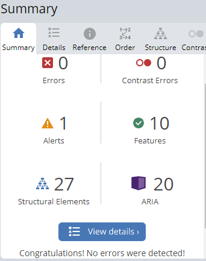

# Wannabe Healthy: Testing

Back to the [README](README.md)

Testing has taken place continuously throughout the development of the project. When faults were detected they were fixed on an ongoing basis. These were fixed locally in GitPod and committed to GitHub regularly. Faults fixed and outstanding can be found in the README.md Document.

# Table of Contents 

1. [Cross Browser Testing](#browsertesting)
2. [Responsive Testing](#responsivetesting)
3. [Validator Testing](#validatortesting)
     1. [W3C Validator](#w3c)
     2. [CSS Validator](#css)
     3. [Python](#python)
     4. [Lighthouse](#lighthouse)
     5. [Accessabilty](#accessability)
     6. [Contrast Checker](#contrastchecker)
     7. [WAVE](#wave)
     8. [Link Checker](#linkchecker)
4. [Manual Testing](#manual)
5. [User Story Testing](#userstorytesting)  

#### [Return to README.md](README.md)
----

## Cross Browser Testing

  The site was tested in Google Chrome, Microsoft Edge and  Mozilla Firefox on the Desktop. The site was tested on a Lenovo Laptop, and a Xiomai Redmie Note 11. 

 

#### [Return to Table of Contents](#toc)

----
## Responsive Testing

   I regularly tested the responsiveness of the site using Google Chrome Developer tools, information on this can be found [here](https://developer.chrome.com/docs/devtools/). I also used Window Resizer and a Responsive Design Tester Application available in the Google Chrome Store(was fairly good on all screens, but can be problematic with ipad mini). I also used the Am I responsive site to test the site and the image below is from that Testing:

    

   
      
         
   

     

#### [Return to Table of Contents](#toc)

----
## Validator Testing

1. W3C Validator 

Using [https://validator.w3.org/](https://validator.w3.org/) All Pages were tested with the validator, the results of the HTML validation can be seen below:

 

      
        

   
  
1. Jigsaw CSS Validator   
 
Using [https://jigsaw.w3.org/css-validator/](https://jigsaw.w3.org/css-validator/) 
The result can be seen below:

 

      
        

 

1. Python Validation   
  Python testing was done without the use of Pep8 as the site was down, instead an extension was added which highlighted errors and showed them in the problems panel within gitpod. Most errors related to long lines, but there were some syntax errors which I rectified. I also used [Code Institute Python Linter](https://pep8ci.herokuapp.com/), just to be certain, and there was no errors (It does not like the end line, but when I remove it the gitpod linter asks for it to be inserted)

   

  
      
        
  

  
   

2. Lighthouse Testing   

Tested all the pages, they were all mostly 100 for Accesability, Best Practise and SEO in the desktop, although I had issues with testing the profile page but did manage to do it in the end. Not as high in the mobile. Performance score tended to fluctuate even in incognito, but I have had issues within other projects in using lighthouse, and am not sure it's a true reflection of actual performance.

      
         

  

1. Accessability Testing   
Used this tool, [Accesibility Test](https://accessibilitytest.org/) which carries out a range of tests on the site and the score can be seen below:

      
         

  

6. Contrast Checker  
  
  Using [https://color.a11y.com/](https://color.a11y.com/) on all pages, there were a couple of contrast problems, but changed colours of flash for authors in blogs and recipes and there are no erros. Just showing result for one page, but all pages showed the same results.  See images Below.

 
  
      
        
  

  
   

7. Wave (Web Accesability Evaluation tool)   
  
  Using [WAVE](https://chrome.google.com/webstore/detail/wave-evaluation-tool/jbbplnpkjmmeebjpijfedlgcdilocofh), this is a web accesability tool developed by WebAIM.org. It provides visual feedback about the accessibility of your web content, it highlights any errors and gives you possible suggestions for improvements. There was a couple of issues with missing form labels for search bars, but researched how to fix the issue and resolved the issue with a simple tip:

    <label for="siteSearch" class="sr-only">Search</label>
    <input type="text" name="search" id="siteSearch>
    <input type="submit" value="Search">

  This seemed to work within GitPod but on the Heroku site it showed the word, so with some extra css, this seems to have been resolved.  

  There were issues in testing the profile page, as it is not iterable in a number of testing tools. 

  Results differed for different pages, there was no errors, but there were a few warnings, mainly about the order of headings, but decisions were made for the aesthtethics of the site and using all headings in order on the page was not possible. There was also an issue with the logo and home nav item linking to same address, but generallly I use the logo to return to main page as routine and the home page also needs to be included as it is necessary for the navigation of the site. 

   

  
      
        
  

  
   

8. Link Checker   
Besides manually checking links on the site I used this tool as an extra measure for testing and the result can be seen below:

 

  
      
        
  

  
   

 #### [Return to Table of Contents](#toc)
----

### 4. Manual Testing   

Testing was carried out on a number of levels, so I have broken the manual testing into 2 sections, the first gives an overview of how the site works and whether it does what is expected. In the second section I have more specific testing of different elements within each page and the results I received in a more condensed version.

<h3 align ="center">      
    Manual Testing (Overview of how the Site works in general)   
</h3>

### On the Site:
- Start Screen displays when Heroku link is used.   :heavy_check_mark:
- The index page displays correctly with the functionality expected for a user that is not logged in. :heavy_check_mark:
- The navbar displays correctly for a user that is not logged in, the account link in navbar is present.  :heavy_check_mark:
- The sign up link opens up the sign up form and allows a User to register for the site.  :heavy_check_mark:
- The Login Link opens up the login form and allows the User to login into the site.  :heavy_check_mark:
- The navbar displays the Profile link when the user has logged in.  :heavy_check_mark:
- The navbar displays the profile image of the logged in user in the navbar.  :heavy_check_mark:
- The navbar displays the Logout link when the user has logged in.  :heavy_check_mark:
- The add blog button is displayed when the User logs in.  :heavy_check_mark:
- The home page displays the collection of blogs (6 blogs per page) and pagination is working to display those in excess of that number.  :heavy_check_mark:
- The logged in user can see the edit and delete buttons for any blog they have submitted.  :heavy_check_mark:
- The Title and excerpt of each blog can be used as a link to the post_detail page of each blog, when used the User is redirected to this page successfully.  :heavy_check_mark:
- The Post_detail page displays correctly.  :heavy_check_mark:
- When the logged in user click the like button, they receive a message that they have liked a blog, if they press again, they receive a message that they have unliked the blog.  :heavy_check_mark:
- The comment form displays for a logged in user, and if they submit a comment, they receive a message that their comment is awaiting approval of the admin. When this is approved it is displayed within the comment section.  :heavy_check_mark:
- The like icon shows the number of likes the blog has received.  :heavy_check_mark:
- The comment icon shows the number of comments that the blog has received. :heavy_check_mark:
- The profile image and bio of the blog author displays correctly in the post_detail page.  :heavy_check_mark:
- In the home page, within each blog(that user has submitted) the edit button when used will open up the edit_post Form, when this form is submitted, any changes are updated within the blog post, and the user is redirected to the home page.  :heavy_check_mark:
- In the home page, within each blog(that user has submitted) the delete button when used will open up the delete_post Form, the title of the post is displayed and the user is asked whether they are sure they want to delete the post,if this is confirmed the blog post will be deleted and the user will be redirected to the home page.   :heavy_check_mark:
- In the home page the user can enter a search category or word and the results will be displayed.   :heavy_check_mark:
- If there are no results, the user is given a message that there are no results to display.   :heavy_check_mark:
- The user can use the back button to be redirected to the home page.    :heavy_check_mark:
- The about page displays correctly.  :heavy_check_mark:
- The recipes page displays the collection of recipes (6 recipes per page) and pagination is working to display those in excess of that number.  :heavy_check_mark:
- The add recipe button displays correctly for the logged in user.  :heavy_check_mark:
- The logged in user can see the edit and delete buttons for any recipe they have submitted.  :heavy_check_mark:
- The 'see details' button within each recipe will direct the user to the recipe-detail page for each recipe.  :heavy_check_mark:
- The recipe_detail page displays correctly.  :heavy_check_mark:
- When the logged in user click the like button, they receive a message that they have liked a recipe, if they press again, they receive a message that they have unliked the recipe.  :heavy_check_mark:
- The comment form displays for a logged in user, and if they submit a comment, they receive a message that their comment is awaiting approval of the admin. When this is approved it is displayed within the comment section.  :heavy_check_mark:
- The like icon shows the number of likes the recipe has received.  :heavy_check_mark:
- The comment icon shows the number of comments that the recipe has received. :heavy_check_mark:
- The profile image and bio of the recipe author displays correctly in the recipe_detail page.  :heavy_check_mark:
- In the recipes page, within each recipe(that user has submitted) the edit button when used will open up the edit_recipe Form, when this form is submitted, any changes are updated within the recipe, and the user is redirected to the recipes page.  :heavy_check_mark:
- In the recipes page, within each recipe(that user has submitted) the delete button when used will open up the delete_recipe Form, the title of the recipe is displayed and the user is asked whether they are sure they want to delete the recipe,if this is confirmed the recipe will be deleted and the user will be redirected to the recipes page.  :heavy_check_mark:
- When the profile link in navbar is chosen the profile page displays correctly.  :heavy_check_mark:
- A Profile is created automatically when a User registers for the site.  :heavy_check_mark:
- The username of the new user is displayed in the profile page.
- A generic image is automatically generated until the user uploads an image of their own.  This can be displayed in the navbar profile image and blog/recipe detail pages, if user does not upload a new image of their own.  :heavy_check_mark:
- When user uses edit button on profile page, the edit_profile form is displayed and the user can add bio details and an image. The user is then redirected back to the profile page, to see these changes. :heavy_check_mark:
- When the user uses the logout link the logout form is displayed and the user can logout, The user is asked whether they want to leave the site.  :heavy_check_mark:

### Admin Panel:
- Managed to create, update and delete data in all models, during the entire project, and all seems to be working as expected when logged in as the admin.  :heavy_check_mark:
- When a User comments on a post, Admin needs to approve before it is displayed on the site, this is working as expected, when logged in as the admin.  :heavy_check_mark:
- All required fields need to be filled in when posting a new recipe and blog, and the user is advised on these requirements when filling these forms.  :heavy_check_mark: 

<h3 align ="center">      
    Manual Testing (More Specific Testing of Elements in the Pages)   
</h3>

 

  
Manual Testing(part 2)

 

### Navigation (on all pages)

 

| Feature            |  Expect                       | Action   | Result    |
| ------------------ | ----------------------------- | -------- | ----------|
|  Logo              | Navigation Link               | Click On |   ✔       | 
|  Home              | Navigation Link               | Click On |   ✔       |
|  About             | Navigation Link               | Click On |   ✔       |
|  Recipes           | Navigation Link               | Click On |   ✔       |
|  Account           | Dropdown Menu                 | Click On |   ✔       |
|  Sign Up           | Navigation Link               | Click On |   ✔       |
|  log In            | Navigation Link               | Click On |   ✔       |
|  Profile           | Navigation Link               | Click On |   ✔       |
|  Log Out           | Navigation Link               | Click On |   ✔       |

 

### Footer  (on all Pages)

| Feature           |  Expect                                   | Action   | Result   |
| ------------------| ----------------------------------------- | -------- | ---------|
| Icon Facebook    | Social Media Link - goes to external site | Click On |   ✔       |
| Icon Twitter     | Social Media Link - goes to external site | Click On |   ✔       | 
| Icon Instagram   | Social Media Link - goes to externalsite  | Click On |   ✔       |

 

Home Page

| Feature             |  Expect                    | Action       | Result    |
| --------------------| -------------------------- | --------     | ----------|
| Sign in Message     | Displays Correctly         | Automatic    |    ✔      |                      
| Add a Post Button   | Opens add Post Form        | Click On     |    ✔      |     
| Edit Post Button    | Opens Edit Post Form       | Click On     |    ✔      |
| Delete Post Button  | Opens Delete Post Form     | Click On     |    ✔      |
| Like Heart & No     | Shows number of Likes      | Automatic    |    ✔      |
| Comment & No        | Show number of Comments    | Automatic    |    ✔      |
| Search Bar          | Search for Category/word   | Input Details|    ✔      |
| If Results to Search| Results are Displayed      | Click On     |    ✔      |
| If no Results       | Message Shown to Advise    | Click On     |    ✔      |
| Next(Pagination)    | Go to Next Page of Blogs   | Click On     |    ✔      |
| Prev(Pagination)    | Go to Previous Page        | Click On     |    ✔      |
| Top Button          | Go to Top of Screen        | Click On     |    ✔      |
| Zoom Effect on Blogs| Zoom Effect                | Hover        |    ✔      |
| Choose a Blog       | Go to Post_Detail Page     | Click On     |    ✔      |

 

Post Detail Page

| Feature                 |  Expect                    | Action       | Result    |
| --------------------    | -------------------------- | --------     | ----------|
| Category of Blog        | Displays Correctly         | Automatic    |    ✔      |
| Blog is featured        | Displays Correctly         | Automatic    |    ✔      |
| Edit Button shows       | Displays if User is author | Automatic    |    ✔      |
| Edit Button             | Opens the Edit_Blog Form   | Click On     |    ✔      |
| Delete Button shows     | Displays if User is author | Automatic    |    ✔      |
| Delete Button           | Opens the Delete_Blog Form | Click On     |    ✔      |
| Like Heart & No         | Shows number of Likes      | Automatic    |    ✔      |
| Comment & No            | Show number of Comments    | Automatic    |    ✔      |
| Can like/unlike         | Shows an extra like/unlike | If logged in |    ✔      |
| Author Profile displayed| Displays Correctly         | Automatic    |    ✔      |
| Comments are displayed  | Displays Correctly         | If logged in |    ✔      |
| Comment Form shown      | Displays Correctly         | If logged in |    ✔      |
| Submit Comment Button   | Submit a comment           | If logged in |    ✔      |
| Back Button             | Go to Home Page            | Click On     |    ✔      |     

 

Add A Post Form Page

| Feature             |  Expect                     | Action    | Result|
| --------------------| --------------------------  | --------  | ------|
| Category Field      | Shows Categories            | Click On  |   ✔   |
| Input Fields        | Accepts input               | Input     |   ✔   |
| Image Upload        | Uploads Image               | Click On  |   ✔   |
| Status Field        | Shows Options               | Click On  |   ✔   |
| Add Post Button     | Adds Post                   | Click On  |   ✔   |
| Back Button         | Go to Home Page             | Click On  |   ✔   | 

 

Edit A Post Form Page

| Feature             |  Expect                     | Action    | Result|
| --------------------| --------------------------  | --------  | ------| 
| Category Field      | Shows Categories            | Click On  |   ✔   |
| Input Fields        | Accepts input               | Input     |   ✔   |
| Image Upload        | Uploads Image               | Click On  |   ✔   |
| Status Field        | Shows Options               | Click On  |   ✔   |
| Edit Post Button    | Adds Post                   | Click On  |   ✔   |
| Back Button         | Go to Home Page             | Click On  |   ✔   | 

 

Delete a Post Form Page

| Feature             |  Expect              | Action    | Result|
| --------------------| -------------------- | --------  | ------| 
| Blog Name           | Displayed to User    | Automatic |   ✔   |
| Delete Button       | Deletes the Blog     | Click On  |   ✔   |
| Back Button         | Go to Home Page      | Click On  |   ✔   | 

 

About Page

| Feature                 |  Expect                      | Action      | Result  |
| --------------------    | --------------------------   | --------    | ------  | 
| See Recipes Buttons(2)  | Go to Recipes Page           | Click On    |   ✔    |
| See Blog Button         | Go to Home Page              | Click On    |   ✔    |
| Top Button              | Go to Top of Screen          | Click On    |   ✔    |
| Zoom Effect in Pics     | Zoom Effect                  | Hover       |   ✔    |
| Back Button             | Go to Home Page              | Click On    |   ✔    | 

 

Recipes Page

| Feature               |  Expect                    | Action       | Result    |
| --------------------  | -------------------------- | --------     | ----------|                      
| Add a Recipe Button   | Opens add Recipe Form      | Click On     |    ✔      |     
| Edit Recipe Button    | Opens Edit Recipe Form     | Click On     |    ✔      |
| Delete Recipe Button  | Opens Delete Recipe Form   | Click On     |    ✔      |
| Like Heart & No       | Shows number of Likes      | Automatic    |    ✔      |
| Comment & No          | Show number of Comments    | Automatic    |    ✔      |
| Search Bar            | Search for Category/word   | Input Details|    ✔      |
| If Results to Search  | Results are Displayed      | Click On     |    ✔      |
| If no Results         | Message Shown to Advise    | Click On     |    ✔      |
| Next(Pagination)      | Go to Next Page of Recipes | Click On     |    ✔      |
| Prev(Pagination)      | Go to Previous Page        | Click On     |    ✔      |
| Top Button            | Go to Top of Screen        | Click On     |    ✔      |
| Zoom Effect on Recipes| Zoom Effect                | Hover        |    ✔      |
| Select Recipe Button  | Go to Recipe_Detail Page   | Click On     |    ✔      |

 

Recipe Detail Page

| Feature                 |  Expect                    | Action       | Result    |
| --------------------    | -------------------------- | --------     | ----------|
| Category of Recipe      | Displays Correctly         | Automatic    |    ✔      |
| Recipe is featured      | Displays Correctly         | Automatic    |    ✔      |
| Edit Button shows       | Displays if User is author | Automatic    |    ✔      |
| Edit Button             | Opens the Edit_Recipe Form | Click On     |    ✔      |
| Delete Button shows     | Displays if User is author | Automatic    |    ✔      |
| Delete Button           | Opens the Delete_Blog Form | Click On     |    ✔      |
| Like Heart & No         | Shows number of Likes      | Automatic    |    ✔      |
| Comment & No            | Show number of Comments    | Automatic    |    ✔      |
| Can like/unlike         | Shows an extra like/unlike | If logged in |    ✔      |
| Author Profile displayed| Displays Correctly         | Automatic    |    ✔      |
| Comments are displayed  | Displays Correctly         | If logged in |    ✔      |
| Comment Form shown      | Displays Correctly         | If logged in |    ✔      |
| Submit Comment Button   | Submit a comment           | If logged in |    ✔      |
| Back Button             | Go to Recipes Page         | Click On     |    ✔      |     

 

Add A Recipe Form Page

| Feature             |  Expect                     | Action    | Result|
| --------------------| --------------------------  | --------  | ------|
| Category Field      | Shows Categories            | Click On  |   ✔   |
| Input Fields        | Accepts input               | Input     |   ✔   |
| Image Upload        | Uploads Image               | Click On  |   ✔   |
| Difficulty Level    | Shows Options               | Click On  |   ✔   |
| Status Field        | Shows Options               | Click On  |   ✔   |
| Add Recipe Button   | Adds Recipe                 | Click On  |   ✔   |
| Back Button         | Go to Recipes Page          | Click On  |   ✔   | 

 

Edit A Recipe Form Page

| Feature             |  Expect                     | Action    | Result|
| --------------------| --------------------------  | --------  | ------| 
| Category Field      | Shows Categories            | Click On  |   ✔   |
| Input Fields        | Accepts input               | Input     |   ✔   |
| Image Upload        | Uploads Image               | Click On  |   ✔   |
| Difficulty Level    | Shows Options               | Click On  |   ✔   |
| Status Field        | Shows Options               | Click On  |   ✔   |
| Edit Recipe Button  | Adds Recipe                 | Click On  |   ✔   |
| Back Button         | Go to Recipes Page          | Click On  |   ✔   | 

 

Delete a Recipe Form Page

| Feature             |  Expect              | Action    | Result|
| --------------------| -------------------- | --------  | ------| 
| Recipe Name         | Displayed to User    | Automatic |   ✔   |
| Delete Button       | Deletes the Recipe   | Click On  |   ✔   |
| Back Button         | Go to Recipes Page   | Click On  |   ✔   | 

 

Profile Page

| Feature             |  Expect                  | Action    | Result|
| --------------------| --------------------     | --------  | ------| 
| Username            | Displayed to User        | Automatic |   ✔   |
| Userimage           | Displays generic image   | Automatic |   ✔   |
| Userbio             | Displays to User         | Automatic |   ✔   | 
| Edit Profile Button | Opens Edit Profile Form  | Click On  |   ✔   |

 

Edit Profile Page

| Feature             |  Expect                  | Action    | Result|
| --------------------| --------------------     | --------  | ------| 
| Image Upload        | Uploads Image            | Click On  |   ✔   |
| Userbio             | Accepts Input            | Input     |   ✔   | 
| Update Button       | Updates User Information | Click On  |   ✔   |
| Back Button         | Go to Profile Page       | Click On  |   ✔   | 

 

Sign Up Page

| Feature             |  Expect                        | Action    | Result    |
| --------------------| ----------------------------   | --------- | ----------|
|  Input Fields       | Accept input                   |  Input    |   ✔       |
|  Sign Up Button     | Register for Site              | Click On  |   ✔       |
|  Link to Login      | Go to Login Page               | Click On  |   ✔       |
| Profile for Site    | User gets Profile if registered| Automatic |   ✔       |

 

Login Page

| Feature             |  Expect                      | Action    | Result    |
| --------------------| ---------------------------- | --------- | ----------|
|  Input Fields       | Accept Input                 |  Input    |   ✔       |
|  Log In Button      | Log in to Site               | Click On  |   ✔       |
|  Sign Up Link       | Go to SignUp Page            | Click On  |   ✔       |

 

Sign Out Page

| Feature             |  Expect                          | Action    | Result    |
| --------------------| ----------------------------     | --------- | ----------|
|  Sign Out Button    | Sign Out and return to home page | Click On  |   ✔       |

 

 

### [Return to Table of Contents](#toc)
----

 

### 5. User Story Testing

  

#### As a Website User I can....

1. Navigate around the site and easily view the type of content available.

- The Navbar is available on each page of the wbsite, it contains links to all areas in the site. There is introductory text on the home page, which clearly indicates the theme of the site, and the type of information that will be available within the site.

2. View a collection of Blogs in the blog Section.

- The Home page contains a collection of blogs and they are classified in a selection of categories. The Categories are Diet, Health, Relaxation and Exercise. There is pagination included, so extra blogs are displayed(6 blogs per page) on next page.

3. Search the blog section for particular categories or by title content.

- Above the blogs, there is a search bar where the User can search by category type, or a word within a blog title. If there are no search results for a specific search, a message is displayed to the user, telling them no result was found and they are given an option to try again or return to the main home page.

4. Click on a blog item and view more indepth content of the selected blog.

- When a User clicks on a blog, they are taken to the post_detail page, where they can see the full details of the Blog.The page will display a blog image, the blog content and the bio details for the Post author.

5. Register for an account to avail of full features of the site.

- When a User registers on the site, they have access to full functionality within the site.  They are able to add,edit or delete a blog or recipe. They can like/unlike a blog/recipe, They can leave a comment for a blog/recipe. They will have their own Profile on the site and they can add/update the details within their own profile.

6. View the number of likes on a blog.

- Below individual blog posts there is a heart icon and a number which relates to the number of likes that the blog has received. This can be seen on the home and the post_detail pages.

7. View comments left for different blogs in the collection.

- The general User can see comments that have been added to any blog, when not logged in. 

8. View a collection of Recipes in the Recipe Page.

- The Recipes page contains a collection of Recipes and they are classified in a number of categories including Breakfast, Lunch, Dinner, Desserts and Soups/Salad. There are 6 Recipes per page and pagination enables recipes to be displayed on the next page.

9. Search through recipes for particular categories or by name in title.

- Above the recipes, there is a search bar where the User can search by category type, or a word within a Recipe title. If there are no search results for a specific search, a message is displayed to the user, telling them no result was found and they are given an option to try again or return to the recipes page.

10. Click on a Recipe to see full details of that recipe.

- When a User clicks on the 'see detail' button, they are taken to the recipe_detail page, where they can see the full recipe on a seperate page. The page will display a recipe image, the recipe and the bio details for the Recipe author.

11. View the number of likes on a Recipe.

- Below individual recipe posts there is a heart icon and a number which relates to the number of like that the recipe has received. This can be seen on the recipes and the recipe_detail pages.

12.  View any comments left on a Recipe. 

- The general User can see comments that have been added to any recipe, when not logged in. 

 

#### As a logged in User I can…...  

1. I can add a new post or a recipe.

- When logged in, a User can see the button for adding a blog, this is only visible to the logged in user. The User can either publish or draft a blog/recipe, if drafted, the blog will not be visible, until the status has been changed to published. Within the Form there is a Text Editor so that the User can format their Posts/Recipes.

2. I can like/unlike a blog or recipe on the site.

- As a logged in User you can like or unlike a blog or recipe and this will added to the number of like that the blog/recipe has. 

3. I can leave comments on particular blogs and recipes.

- As a logged in User you will be able to see the comment submission form under the blog/recipe in the post_detail page and the recipe_detail page. You can submit a comment, but it will not be added until the admin approves it, this is to ensure any comment is suitable for inclusion.

4. I can update my Profile for the site by adding a Bio and Image.

- As a logged in User, the profile link is available within the navbar and their profile image will be displayed to the right of the nav links in the navbar. They will be able to access the profile page and review the profile details. They will also be able to access the edit_profile page and be able to update their bio details and upload an image.

5. I can edit a Blog or Recipe that I have submitted to the site.

- As a logged in User, they have access to an edit button below their blog in the blog sections, this allows them to update the details of the blog in the edit_post page. When this form is submitted they will be redirected to the home page and the changes will be applied. There is also an edit button below their submitted recipes, and this will allow them to access the edit_recipe page. When this form is submitted they will be redirected to the recipes page and the changes will be applied. If the user is logged in and has published a post/recipe they can also access the edit button on the post_detail and recipe_detail page.

6. I can delete a Recipe or Blog that I have submitted to the site.

- As a logged in User, they have access to the delete button below their blog in the blog section, this allows them to delete their blog in the delete_post page. When this form is submitted, their blog will be deleted.. There is also a delete button below their submitted recipes, and this will allow them to delete their recipe. When this form is submitted they will be redirected to the recipes page and the recipe will be deleted. If the user is logged in and has published a post/recipe they can also access the delete button on the post_detail and recipe_detail page.

 

#### As a Superuser/Admin I want to...

1. Create and publish a new blog or recipe.

- As an Admin you can publish a new blog or recipe for the site, initially before building the frontend this was how blogs were added to the site, but now any logged in user can add blogs or recipes.

2. Create draft recipes and blog posts that can be finalised later.

- The Admin can either publish or draft a blog/recipe, if drafted, the blog or recipe will not be visible on the site, until the status has been changed to published. Currently the admin/superuser only has the functionality to create draft posts, but they can change the status of any draft post created by a user in the frontend.

3. Create a new user, recipes and blogs.

- The Admin can create a new user, add a recipe or a blog to the site. As an extra function they can also add profiles, as the profile app was created last, as an admin I created profiles for users who had registered before the profile creation when registering was enabled.

4. Delete user, blogs, recipes and comments.

- The Admin can delete a User, a Blog or a Recipe and can remove comments from Blogs and Recipes.

5. Can approve user's comments.

- The Admin can approve a User's comments and when this occurs the comment will appear in the comment section of the blog/recipe detail pages on the site.

 

#### [Return to Table of Contents](#toc)
#### [Return to README.md](README.md)

----

